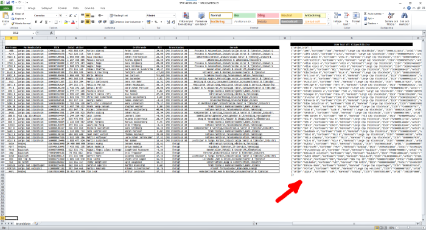
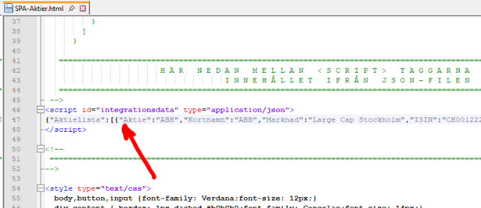
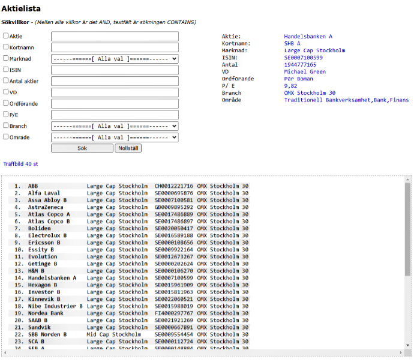
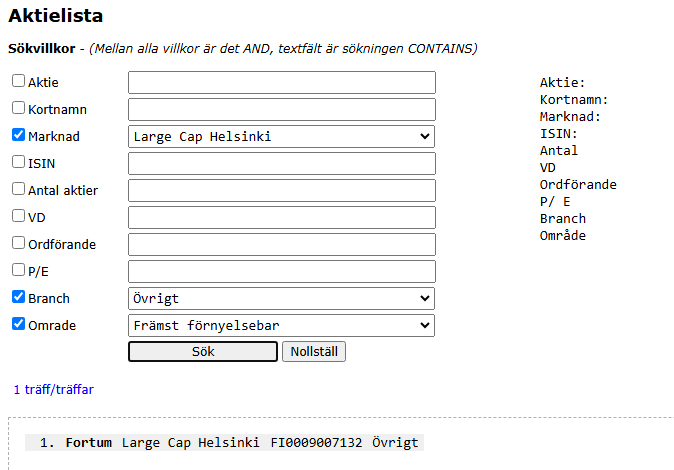

## SPA-Sökning (Single Page Application)

Ett Excelark för att fylla i information och till höger (den röda bilden) så finns en formula för att skapa JSON-kod
som man lägger in i HTML-sidan.



Excel formeln som används för att bygga upp posterna i JSON-koden
```
=SAMMANFOGA(
"{"
;TECKENKOD(34);"Aktie";TECKENKOD(34);":";TECKENKOD(34);C4;TECKENKOD(34);","
;TECKENKOD(34);"Kortnamn";TECKENKOD(34);":";TECKENKOD(34);D4;TECKENKOD(34);","
;TECKENKOD(34);"Marknad";TECKENKOD(34);":";TECKENKOD(34);E4;TECKENKOD(34);","
;TECKENKOD(34);"ISIN";TECKENKOD(34);":";TECKENKOD(34);F4;TECKENKOD(34);","
;TECKENKOD(34);"Antal";TECKENKOD(34);":";TECKENKOD(34);G4;TECKENKOD(34);","
;TECKENKOD(34);"VD";TECKENKOD(34);":";TECKENKOD(34);H4;TECKENKOD(34);","
;TECKENKOD(34);"Ordf";TECKENKOD(34);":";TECKENKOD(34);I4;TECKENKOD(34);","
;TECKENKOD(34);"PE";TECKENKOD(34);":";TECKENKOD(34);J4;TECKENKOD(34);","
;TECKENKOD(34);"Branch";TECKENKOD(34);":";TECKENKOD(34);K4;TECKENKOD(34);","
;TECKENKOD(34);"Omrade";TECKENKOD(34);":";TECKENKOD(34);L4;TECKENKOD(34);
OM(VÄNSTER(N5;1)="]";"}";"},")
)
```
Sista raden med logik formeln __OM__ är till för att kontrollera om det finns ytterligare data på nästa rad.
Annars avsluta strukturen.

Nedan visar var i filen som man lägger in den skapade JSON-koden. Man bör ha något program som kan "komprimera" JSON-koden och 
lägga den på en rad (exempelvis via Notepad++ och JSTool-plugin). Helst hade man viljat haft JSON-koden i en separat fil och inkluderat
den. Men det räknas som ett säkerhetshot och stoppar filen. Lägger man in den manuellt så gör man ett aktivt val.



Då kan det se ut enligt bilden nedan och det går att söka i strukturen. Alla villkor som man kryssar för är det
en AND mellan villkoren och fritext rutorna gör en sökning via CONTAINS



JSON-strukturen som används
```
{
  "Aktielista": [{
      "Aktie": "ABB",
      "Kortnamn": "ABB",
      "Marknad": "Large Cap Stockholm",
      "ISIN": "CH0012221716",
      "Antal": "438988614",
      "VD": "Morten Wierod",
      "Ordf": "Peter Voser",
      "PE": "24,68",
      "Branch": "OMX Stockholm 30",
      "Omrade": "Process & Automation,Industriella Varor & Tjänster,Industri"
    }
  ]
}
```

Exempel på en sökning



