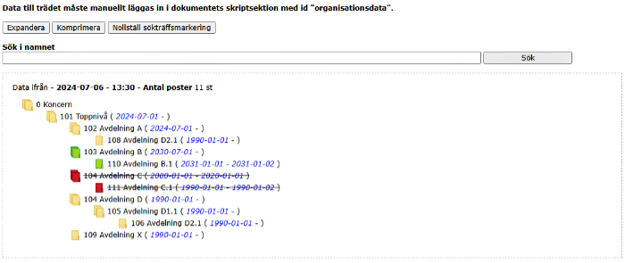
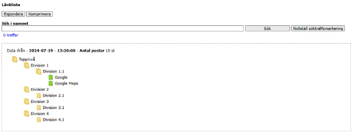

## Trädstrukturer & Länklistor

Bilden nedanför visar ett sätt som man exempelvis kan visualisera en organisation



JSON-strukturen som används:
```
{
  "Datum": "2024-07-06",
  "Tid": "13:30",
  "Trad": [{
      "id": 1,
      "niva": 101,
      "kod": 101,
      "nivaOvanId": 0,
      "nivaOvanKod": 0,
      "giltigFrom": "20240701",
      "giltigTom": "",
      "namn": "Toppnivå"
    }, {
      "id": 2,
      "niva": 102,
      "kod": 102,
      "nivaOvanId": 1,
      "nivaOvanKod": 101,
      "giltigFrom": "20240701",
      "giltigTom": "",
      "namn": "Avdelning A"
    }
  ]
}
```


Bilden nedanför visar ett sätt som man skulle kunna visualisera en lista med länkar till olika webbsidor



JSON-strukturen som används:
```
{
  "Datum": "2024-07-19",
  "Tid": "13:20:00",
  "Trad": [{
      "id": "1",
      "nivaOvanId": "0",
      "namn": "Division 1"
    }, {
      "id": "2",
      "nivaOvanId": "0",
      "namn": "Division 2"
    }, {
      "id": "3",
      "nivaOvanId": "0",
      "namn": "Division 3"
    }, {
      "id": "4",
      "nivaOvanId": "0",
      "namn": "Division 4"
    }, {
      "id": "5",
      "nivaOvanId": "1",
      "namn": "Division 1.1"
    }, {
      "id": "6",
      "nivaOvanId": "2",
      "namn": "Division 2.1"
    }, {
      "id": "7",
      "nivaOvanId": "3",
      "namn": "Division 3.1"
    }, {
      "id": "8",
      "nivaOvanId": "4",
      "namn": "Division 4.1"
    }, {
      "id": "9",
      "nivaOvanId": "5",
      "namn": "Google",
      "lank": "https://www.google.se/"
    }, {
      "id": "10",
      "nivaOvanId": "5",
      "namn": "Google Maps",
      "lank": "https://www.google.se/maps/"
    }
  ]
}
```

